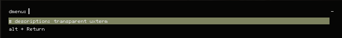
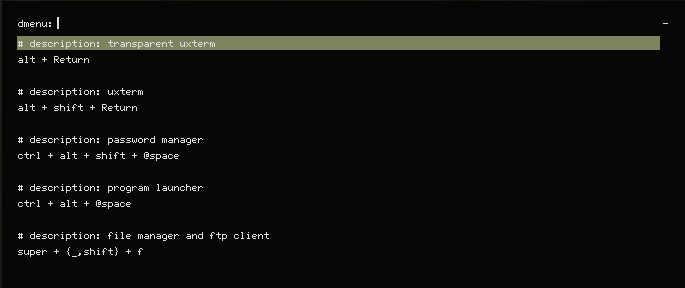

# sxhkd-bindings
A low quality shell script to parse and display keybindings + descriptions.

# Requirements
- Grep
- Sed
- Rofi
- sxhkdrc setup in the proper format (more info below)

# sxhkdrc format
In order to parse properly, you need to place some stuff into your rc file.<br>
You need to place a one line comment directly above a keybinding with this format: `description: DESCRIPTION`.

For example:
```
# description: transparent uxterm
alt + Return
    uxterm & sleep 0.25 && transset -a 0.8
```

Which will output:


And here is what a more full example would look like:

