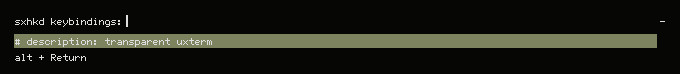
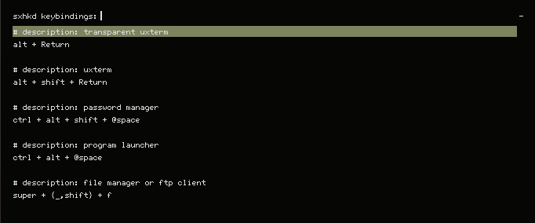

# sxhkd-bindings
A shell script to parse and display keybindings + descriptions, as well as optionally edit them.

# Requirements
- grep
- sed
- [rofi](https://github.com/davatorium/rofi)
- sxhkdrc setup in the proper format (more info below)

# sxhkdrc format
In order to parse properly, you need to place some stuff into your rc file.<br>
You need to place a one line comment directly above a keybinding with this format: `description: DESCRIPTION`.

For example:
```
# description: transparent uxterm
alt + Return
    uxterm & sleep 0.25 && transset -a 0.8
```

Note: It *shouldn't* matter how you capitalize "description" as I have `grep` and `sed` set to use case insensitive searching.<br>
However, it has not been tested, so I have no idea how well it works.

# Screenshots
Example (from above) output:<br>


And here is what a more full example would look like:<br>


You can also display descriptions without "description: " included:<br>


Note: Your rofi will look different due to using a different theme.<br>
If you like the one I'm using, you may find it [here](https://github.com/Phate6660/dotfiles/blob/master/.cache/wal/colors-rofi-dark.rasi) in my [dotfiles repo](https://github.com/Phate6660/dotfiles).

# Installation
1. `curl -sSL https://raw.githubusercontent.com/Phate6660/sxhkd-bindings/master/sxhkd-bindings -o sxkhkd-bindings`
2. Inspect the script. Don't run scripts from the internet without checking them.
3. `chmod +x sxhkd-keybindings`
4. Move the script to anywhere in your `$PATH` and run the command, or just run it as is.

# Usage
`$ sxhkd-bindings h`
```

sxhkd-bindings 0.0.1
Phate6660 <https://github.com/Phate6660>

ARGs
----
d: Display descriptions without "description: "
e: Edit "$HOME/.config/sxhkd/sxhkdrc" with "$EDITOR"
h: Display this help message
Anything not the above args, or nothing at all: Display keybindings and descriptions like normal

```

Note: `$HOME` and `$EDITOR` actually expand, ain't that neato?<br>
So for me, the `e` line actually looks like this:<br>
`e: Edit "/home/valley/.config/sxhkd/sxhkdrc" with "/usr/bin/emacs -nw"`
